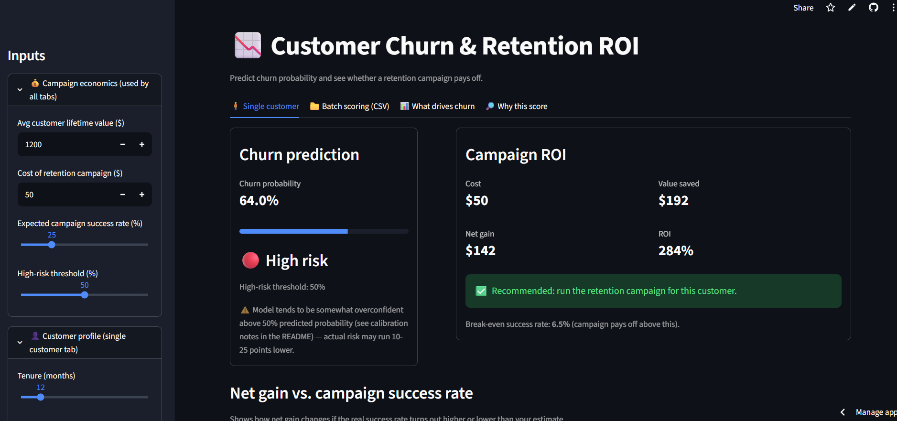

# Customer Churn & Retention ROI

Predicts a telecom customer's churn probability and estimates whether a retention campaign is worth running.

**Live app:** [paste your Streamlit URL]

## Features
- **Single customer:** churn probability, risk level, campaign ROI, and break-even success rate
- **Batch scoring:** upload a CSV, score every customer, see total campaign economics, download results
- **What drives churn:** feature importance grouped by original customer attribute
- Adjustable campaign economics: customer lifetime value, campaign cost, success rate, risk threshold

## Model
- Data: Telco customer churn dataset ([describe source])
- Pipeline: imputation, one-hot encoding, SMOTE for class imbalance, XGBoost classifier
- Metrics on held-out test set: ROC-AUC [__], precision [__], recall [__]

## ROI logic
- Expected value saved = churn probability × campaign success rate × customer lifetime value
- Net gain = expected value saved − campaign cost
- ROI = net gain ÷ campaign cost
- Break-even success rate = campaign cost ÷ (churn probability × customer lifetime value)

`TotalCharges` is estimated as tenure × monthly charges in single-customer mode.

## Run locally
    pip install -r requirements.txt
    streamlit run app.py

## Tech stack
Python, Streamlit, scikit-learn, imbalanced-learn, XGBoost, pandas
