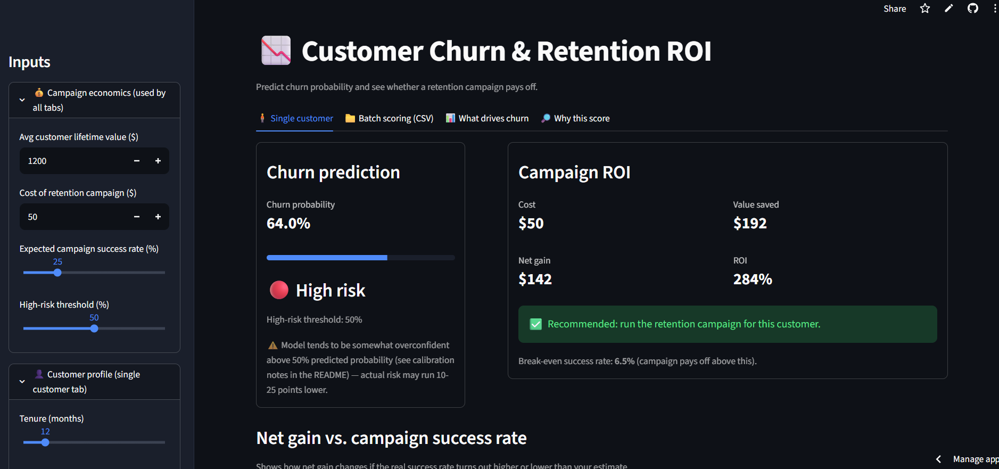

# 📉 Customer Churn & Retention ROI

Predict which telecom customers are likely to churn, then answer the business question that matters: **does a retention campaign actually pay off, and who should it target?**

**Live app:** https://churn-roi-app-v2-4skxsvfpetvweqdcdpcaah.streamlit.app



---

## What it does

| Tab | Purpose |
|---|---|
| **Single customer** | Enter one customer's profile and get a churn probability, campaign cost, expected value saved, net gain, ROI and break-even success rate. Includes a sensitivity chart showing how net gain changes with campaign success rate. |
| **Batch scoring (CSV)** | Upload many customers, score them all, see total cost, value saved, net gain and ROI, and find the **profit-maximizing threshold** for the batch. Download the scored results. |
| **What drives churn** | Global feature importance from the XGBoost model. |
| **Why this score** | Per-customer explanation (tree-based contributions in log-odds) plus a "what if we changed one thing?" tool that shows the model's real predicted probability for every option of an attribute. |

The sidebar holds the campaign economics used by all tabs: average customer lifetime value (LTV), campaign cost, expected success rate and the high-risk threshold.

---

## How the ROI is calculated

For a customer with predicted churn probability `p`:

```
Value saved   = p × success_rate × LTV
Net gain      = Value saved − campaign_cost
ROI           = Net gain / campaign_cost
Break-even p  = campaign_cost / (success_rate × LTV)
```

With the defaults (LTV $1,200, cost $50, success rate 25%) the break-even churn probability is `50 / (0.25 × 1200) ≈ 17%`. Targeting anyone below that loses money on average, which is why the app's default threshold is 17% and why the batch tab's profit curve peaks there.

---

## Model

- **Data:** [IBM Telco Customer Churn](https://www.kaggle.com/datasets/blastchar/telco-customer-churn) (7,043 customers, about 26.5% churn).
- **Split:** 80/20 train/test (`random_state=42`). The test set (1,407 customers) is never used for training or tuning.
- **Preprocessing:** median imputation for numeric features, most-frequent imputation and one-hot encoding for categorical features.
- **Classifier:** XGBoost, tuned with 5-fold `GridSearchCV` (ROC-AUC) over number of trees, depth and learning rate.
- **Class imbalance:** handled with XGBoost's `scale_pos_weight` (≈ 2.76) instead of synthetic oversampling.
- **Calibration:** isotonic regression via `CalibratedClassifierCV` (5-fold), fitted on training data only.

### Why class weighting instead of SMOTE, and why calibrate

The first version used SMOTE. It ranked customers well, but its probabilities ran too high above about 40%, and the ROI maths multiplies by those probabilities. I compared four variants on the held-out test set:

| Model | ROC-AUC | PR-AUC | Brier (lower is better) | Avg predicted churn |
|---|---|---|---|---|
| SMOTE (raw) | 0.8296 | 0.6436 | 0.1442 | 0.299 |
| SMOTE + calibrated | 0.8277 | 0.6405 | 0.1413 | 0.272 |
| Class weights (raw) | 0.8346 | 0.6570 | 0.1693 | 0.416 |
| **Class weights + calibrated (deployed)** | **0.8348** | **0.6543** | **0.1391** | **0.269** |

Actual churn rate in the test set: **0.266**.

Takeaways:
- Class weighting alone ranks customers well, but its raw probabilities are badly inflated (average 0.416 vs an actual 0.266), so it is **not usable for ROI without calibration**.
- Weights + calibration had the best ranking metrics, the lowest Brier score, and an average prediction closest to reality.
- The differences between the two calibrated models are small and come from a single split, so I would not claim a large improvement. I chose it because it is at least as good on every metric and needs no synthetic data.

---

## Results on unseen data

Scoring the held-out 1,407 customers with the deployed model (LTV $1,200, cost $50, success rate 25%):

| Threshold | Customers targeted | Cost | Value saved | Net gain | ROI |
|---|---|---|---|---|---|
| 17% (profit-maximizing) | 722 | $36,100 | $101,069 | **$64,969** | 180% |

Lowering the threshold from 50% to 17% adds roughly $20k of net profit on this batch, while ROI as a percentage falls because the extra customers are lower risk. Total profit is the better objective here, so the app recommends the profit-maximizing threshold.

---

## Assumptions and limitations

- **LTV and success rate are inputs, not measured values.** The dataset contains no true lifetime value and no campaign outcomes. All dollar figures scale directly with the $1,200 LTV and 25% success rate you set. Use the sensitivity chart to see how results change if the real success rate is lower.
- **One LTV for everyone.** A dynamic LTV based on tenure, charges and contract type would be more realistic but would rely on further assumptions.
- **Correlation, not causation.** Feature importance, the explanation chart and the what-if tool describe what the model learned. They do not prove that changing an attribute (for example moving a customer to a two-year contract) will change their behaviour.
- **Explanations use the original model.** The "Why this score" bars come from the uncalibrated XGBoost model, while probabilities come from the calibrated one. Driver rankings match, but exact values can differ slightly.
- **Single dataset, single split.** Results come from one public dataset and one 80/20 split. Real deployment would need monitoring for data drift and recalibration.
- **Threshold is tuned per batch.** The profit-maximizing threshold is computed on the uploaded batch, so treat it as a guide rather than a fixed rule.

---

## Run it locally

```bash
git clone https://github.com/sunnysavarna108-commits/churn-roi-app-v2.git
cd churn-roi-app-v2
pip install -r requirements.txt
streamlit run app.py
```

Try the batch tab with `telco_holdout_test.csv` (the 20% of customers the model never saw).

Models were trained with scikit-learn 1.6.1 and XGBoost 3.4.1. The versions pinned in `requirements.txt` must match, because pickled models can fail to load across versions.

---

## Project structure

```
app.py                                  Streamlit app (UI and charts)
logic.py                                ROI maths, risk levels, batch cleaning
tests/                                  Unit tests
01_data_exploration.ipynb               EDA, training, tuning, calibration, model comparison
churn_pipeline_calibrated_weighted.pkl  Deployed model (probabilities)
churn_pipeline_weighted.pkl             Uncalibrated twin (feature importance and explanations)
telco_holdout_test.csv                  Held-out customers for the batch demo
requirements.txt                        Pinned dependencies
```

The original SMOTE-based pipelines are kept in the repo as `churn_pipeline.pkl` and `churn_pipeline_calibrated.pkl` for comparison.

---

## Tech stack

Python, pandas, NumPy, scikit-learn, imbalanced-learn, XGBoost, Altair, Streamlit.
